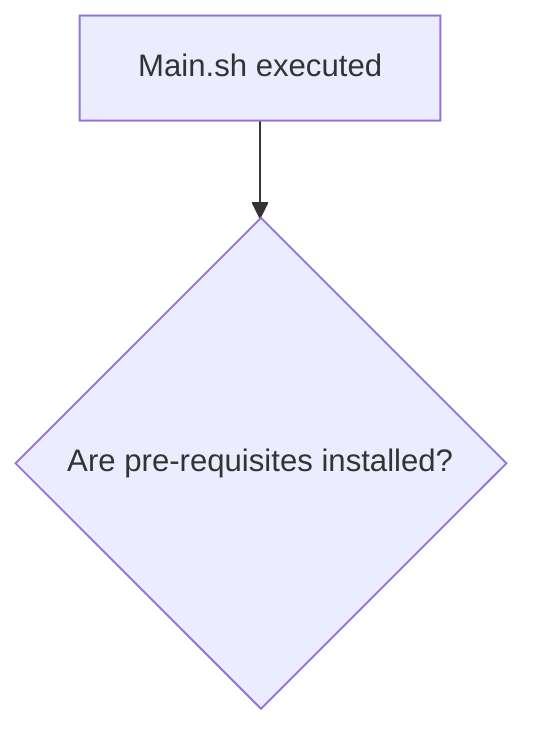

# Setup-Keptn-Using-Jenkins
Setup keptn cli, helm and k3d using Jenkins pipeline.

## How to begin the Installation?
Just execute the main.sh file using this command.
```
bash main.sh
```

The above command will do the following tasks:-
